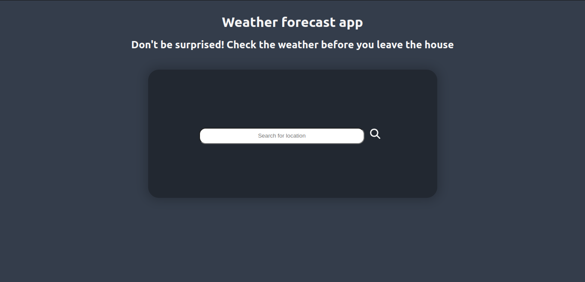
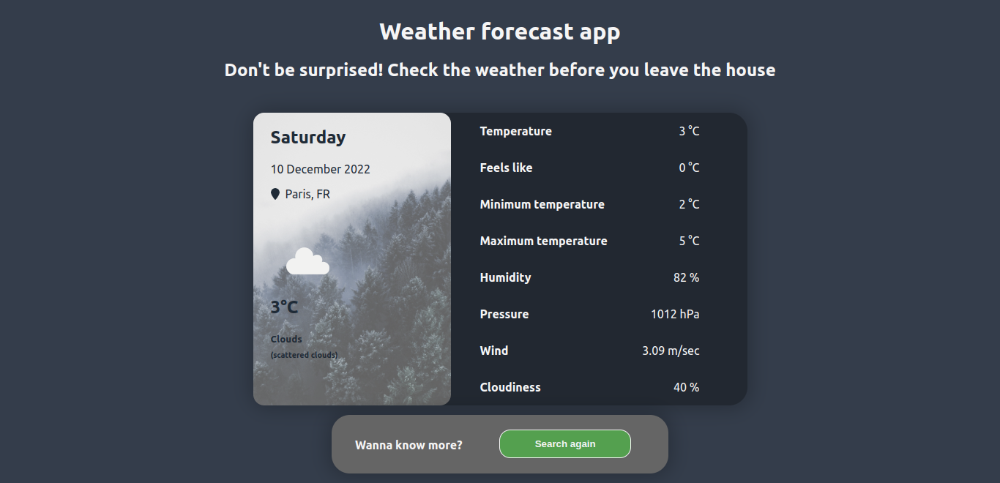
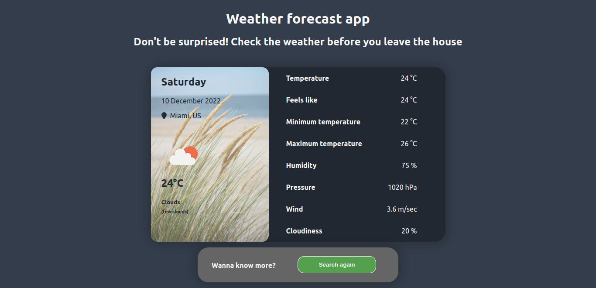
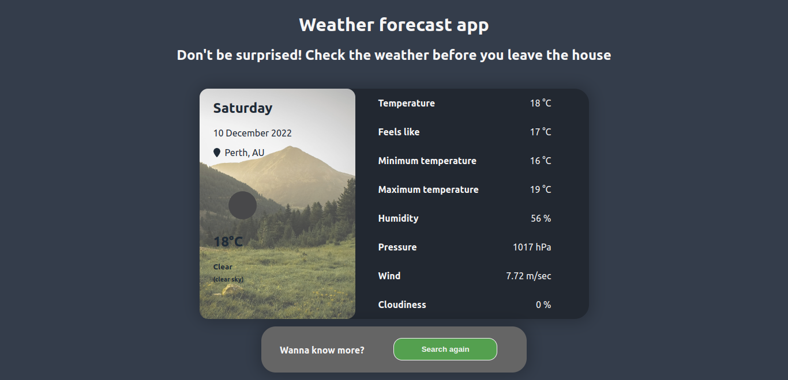
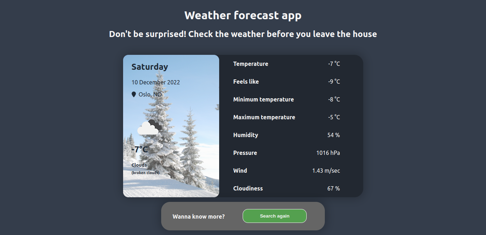

# Weather forecast app

### Description

The weather forecast app created with using React, JavaScript and CSS modules. Also created custom hook to communicate with openweathermap.com API. 

The project constist of:
- searching bar to search a specific location,
- loading spinner to display while connecting to the API,
- when we get a response from API a section with weather data is displayed and also a panel that allows you to search again for different location.

In the section with the data for a specific location the following information is retrieved:
- date, day of the week,
- location,
- weather status icon, 
- temperature, felt temperature, minimum and maximum temperature
- humidity,
- pressure,
- wind,
- cloudiness.

The background image depends on the temperature in specific location.

### Preview

###### Home page

###### Views of specific location

